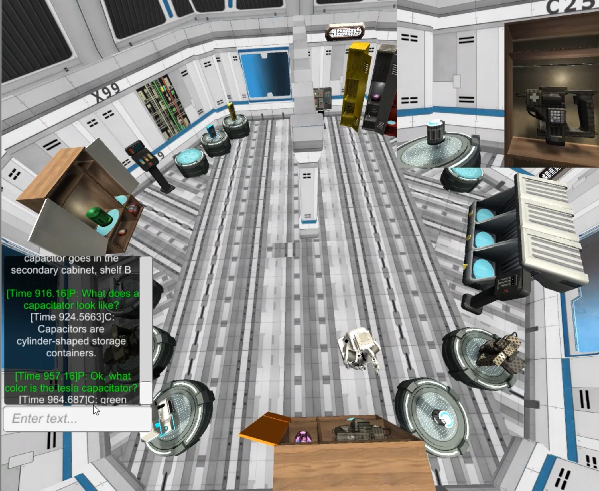

# ARL HuRDL Corpus 1.0.0

ARL HuRDL (Human Robot Dialogue Learning) is a labeled corpus of 22 human-human dialogues in a situated reference resolution task. In the task, participants played the role of a robot and communicated with a live, remote experimenter (called the Commander) through text-based messaging. The experiment was conducted live on Amazon Mechanical Turk. 

The latest version of the dataset can be found [here](https://github.com/USArmyResearchLab/ARL-HuRDL/). 
The corresponding publication with detailed corpus statistics can be found [here](link to Sigdial short paper).

## Table of Contents

- [ARL HuRDL Corpus 1.0.0](#hurdl-corpus-1.0.0)
  * [Interaction Snapshot](#interaction-snapshot)
  * [Data Structure](#data-structure)
  * [Task Domain](#task-domain)
  * [Task Stimuli](#task-stimuli)
  * [Experimental Conditions](#experimental-conditions)
  * [Commander Script](#commander-script)
  * [Dialogue Annotation](#dialogue-annotation)
  * [License](#license)

## Interaction Snapshot
The image below shows the experimenter's (Commander) overhead view of the environment. The participant's (robot) position is shown, and the top right corner shows the participant's first-person view. A message box in the bottom left corner allows for back and forth communication.

## Data Structure
The dialogues are labeled with the participant ID number, an experimental condition (CI or RI), and a counterbalancing condition (A, B, or C), e.g., 02_CI-B. Note that participant IDs are not sequential because some data were excluded. See [below](#experimental-conditions) for more information about conditions and counterbalancing. 

Each dialogue is in CSV format with the following structure: 
- *Condition*: experimental condition
- *ID*: unique participant ID
- *Time*: in each dialogue, 0 marks the introductory message from the Commander
- *Speaker*: Participant (P) or Commander (C)
- *Utterance*: text utterance
- *Question Form*: form of the question (e.g., WHQ, YNQ, etc.)
- *Question Type*: content of the question

See [below](#dialogue-annotation) for more details on dialogue annotation. 

Video files are also provided for each dialogue, which show the top-down Commander view and first-person participant view depicted in the [image](#interaction-snapshot) above. 

## Task Domain
The study was designed to investigate how robots can learn by clarifying uncertainty across multiple modalities in a task-based interaction. Since humans represent a good standard for effective question generation, the study involved human participants playing the role of a robot. The task domain was designed in such as way as to present participants with novel concepts and procedural knowledge that they had to learn in order to elicit a variety of question types.

In the task, human participants played the role of a robot on a spacecraft. The goal was to organize a number of tools scattered around the spacecraft. A complete study run consisted of six *trials*, each one corresponding to a single tool being located and placed in the correct container. 

Participants had a first-person view of the environment, along with an on-screen graphical user interface (GUI) that included a text box to communicate with the Commander and other task-relevant icons. Participants could move the robot using the arrow keys, and pick up / place objects by clicking on them. Only one object could be held at a time, and they could only be placed in designated containers. 

## Task Stimuli
The environment consisted of an open room with various containers, interfaces, objects, and landmarks. The environment also contained six *tool types*, with three *instances* of each type. The tool types were given nonsensical names such that the names could not be used solely to identify the objects. For example, the six tool types were called: *optimizer, calibrator, module, synthesizer, capacitor*, and *emitter*. The instances had an additional prefix added to this label, resulting in object names like *megaband module* and *temporal emitter*. Only six instances were task-relevant, so the remaining twelve were distractors. 

The tools were designed to be heterogeneous with respect to a number of features, including: **color** (red, yellow, blue, etc.), **shape** (short, tall, narrow, wide), **size** (small, medium, large), **texture** (wood, coarse, metal, smooth), **symbol** (x, +, -, etc. on the object), and **pattern** (striped, spotted, no pattern). Each tool type was designed to vary along three randomly-determined feature dimensions, which resulted in a total of 20 combinations of three-feature sets (6 choose 3).

In addition to the tools, the environment also contained a number of *containers* and *interfaces*, which were used to open the containers. There were ten platforms, three lockers (each with two shelves - top / bottom), two cabinets (each with four shelves - A, B, C, D, corresponding to quadrants), and three crates. The lockers, cabinets, and crates were locked and required learning a procedure to open (e.g., entering a passcode, arranging keycards, and pressing buttons).

## Experimental Conditions
Depending on the experimental condition, the Commander either took the initiative (*Commander-Initiative*; *CI*) and gave scripted instructions or only responded to questions (*Robot Initiative*; *RI*). In all conditions, the Commander followed a strict policy with their responses, generally only providing minimal information with each response. 

In the CI condition, the Commander provided each instruction (e.g., "The sonic optimizer goes in the secondary cabinet, shelf A"), whereas in the RI condition, the participant had to establish which tools and locations were relevant. To control for order and sequence effects, the order of instructions was counterbalanced using a Latin-square design based on the initial location of the tools - leading to three conditions. Participants in the RI condition were also assigned to a counterbalancing condition, but this instruction order was not enforced as participants controlled the flow of the dialogue. 

*Instruction granularity* was manipulated as a within-subjects factor such that every participant in the CI condition receiving an equal number of high- and low-level trials in different orders. High-level instructions represent plan specifications, e.g., "The tesla capacitor goes in the secondary cabinet, shelf B". Low-level instructions represent the same plan, but broken down into constituent commands, e.g., "Move to the primary cabinet" -> "Pick up the tesla capacitor from shelf A" -> "Move to the secondary cabinet" -> "Place the tesla capacitor on shelf B". The particular trials of each type were counterbalanced in a similar manner as the instructions.

## Commander Script
The following script was used to set the order of instructions in the CI condition. Included here are both high- and low-level instructions, but only half of each were used, and their order varied depending on the counterbalancing condition. 

1. **High**: The sonic optimizer goes in the secondary cabinet, shelf A    
   **Low**:
	- Move to Crate 2   
   	- Pick up the sonic optimizer from Crate 2   
	- Move to the secondary cabinet   
	- Place the sonic optimizer on shelf A    

2. **High**: The mechano calibrator goes in locker Y, bottom shelf   
   **Low**:
	- Move to Crate 3   
	- Pick up the mechano calibrator from Crate 3
	- Move to locker Y
	- Place the mechano calibrator on the bottom shelf

3. **High**: The tesla capacitor goes in the secondary cabinet, shelf B   
   **Low**:
	- Move to the primary cabinet   
	- Pick up the tesla capacitor from shelf A   
	- Move to the secondary cabinet   
	- Place the tesla capacitor on shelf B   

4. **High**: The temporal emitter goes in the secondary cabinet, shelf D   
   **Low**:
	- Move to the primary cabinet   
	- Pick up the temporal emitter from shelf C   
	- Move to the secondary cabinet   
	- Place the temporal emitter on shelf D   

5. **High**: The megaband module goes in locker Z, top shelf   
   **Low**:
	- Move to the Alpha platform   
	- Pick up the megaband module   
	- Move to locker Z   
	- Place the megaband module on the top shelf   

6. **High**: The optimized synthesizer goes in the primary cabinet, shelf B   
   **Low**:
	- Move to the Delta platform    
	- Pick up the optimized synthesizer   
	- Move to the primary cabinet   
	- Place the optimized synthesizer on shelf B   

## Dialogue Annotation

To label the utterances, the following procedure was used:

1. Identify the *Form* of the utterance:
	- **YNQ**: yes/no questions
	- **AQ**: alternative questions, questions that propose two or more alternatives e.g.: "is it big or is it small?"  "do you mean the green one, red one, or blue one?"
	- **WHQ**: which, who, what, when, where, why, how questions
	- **Statement**: non-questions, e.g. "ok"
	- **Other**: some other type of question, or a non-question for which statement seems wrong

2. (For all Questions, and for Statements that have an Indirect Action) Identify one or more of the *Action* of the utterance and option:
	- **Confirm Object by Feature**: (these are generally YNQs or AQs)
		- **Size**: "you mean the small one?"
		- **Shape**: "the narrow one?"
		- **Color**: "the green one?"
		- **Pattern**: "the striped one?"
		- **Symbol**: "with a circle symbol?"
		- **Texture**: "the coarse one?"
		- **Comparison**: "the one that looks like a snake?", "The one that looks similar?"
		- **Other**: "is there an object on the platform?"  / other features (e.g., "numbers on it")

	- **Confirm Object by Location**: (these are generally YNQs or AQs)
		- **Spatial**: "the one on the left?"
		- **Proximity** (to self): "the nearby one?"
		- **Landmark**: "the one next to the wall panel?"
		- **Deictic Action**: (e.g. involving a referring action like pointing or picking something up): "this one?"
		- **Other**

	- **Confirm Action**: (these are generally YNQs or AQs)
		- **General**: "like that?"  "did I do it right?"
		- **Task-Related**: "are we putting all the spanners in the buffer?" / "does it go in the locker?" / "is the X needed for the task?"
		- **Other**

	- **Query**: (these are generally WHQs)
		- **Object Identification**: (attempting to identify item in world, given a name or reference) "which one is the megaband module?", "which one is that?"
		- **Object Naming**: (attempting to identify name of item, given a description or reference) "what is the large green canister called?" "what is the name of that?"
		- **Object Description**: (asking about a feature of an object, given a name or reference)
			- **General**: "what does X look like?"  
			- **Size**: "what size is it?"
			- **Shape**: "what shape is it?"
			- **Color**:  "what color?", "What color is Y?"
			- **Pattern**:  "what pattern is on it?"
			- **Texture**: "what texture is it?"
			- **Comparison**: "does it look like anything else?"
			- **Other**
		- **Request Teaching**: (asking about how to do things / procedural knowledge) 
			- **General**: "How do I open lockers?"
			- **Target**: "what's the code for crate 3?"
		- **Goal-Related**: (asking about steps of the task, or what the goal is) "what’s next?", "what do I do after that?", "What do you want me to do with the tesla capacitor?"
		- **Location-Related**: "where is shelf B?", "where should I put it?", "where do I put that again?"
		- **Other**

 	- **Other**: "does that clear it up?"

**Examples**:
- P: how do i open it? \[*WHQ: Query: Request Instruction*]
- P: what code is to open crate 2 \[*WHQ: Query: Object Property*]
- P: alright. where does it go?  \[*Statement*] \[*WHQ: Query: Location-Related*]
- P: yellow triangle? \[*YNQ: Confirm Object by Feature: Color, Pattern*]
- P: is it gray? \[*YNQ: Confirm Object by Feature: Color*]
- P: is it in the main cabinet? \[*YNQ: Confirm Object by Location: Landmark*]
- P: is the temporal emitter big or small \[*AQ: Confirm Object by Feature: Size*]
- P: shelf D i assume is the bottom right one \[*Statement: Confirm Object by Location: Spatial*] 

## License
ARL HuRDL Corpus is licensed under the Creative Commons Zero 1.0 Universal (CC0 1.0) license. Please see LICENSE.txt for details.

